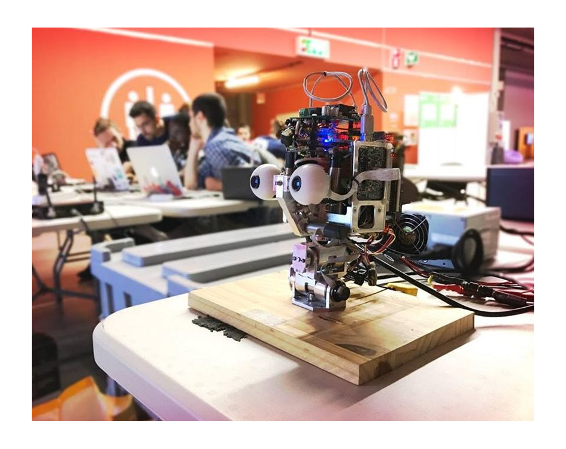
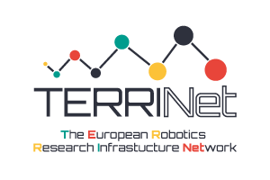

Easy Peasy Robotics Online Crash Course WEB20
=============================================

### Course at glance
Humanoid robots are complex machines, equipped with devices for visual, touch, auditory and force sensing, and embodied with sophisticated algorithms that enable to interact with the surrounding world. Building and programming such robots require expertise in different topics encompassing CAD design, control theory, computer vision, machine learning and software engineering.

We at the [Istituto Italiano di Tecnologia](https://iit.it) (IIT) know quite well what [building humanoids](https://icub.iit.it) means in terms of the effort and the struggle we have to devote to getting a beautiful mechanical body that finally does what we have studied hard to realize. But we also know how exciting and intriguing the science and the technology behind robotics can be and we have been always thrilled to share this awesome learning experience with novices. This is why we continue to organize supporting initiatives like our [summer/winter schools](https://icub.iit.it/projects/courses) and the **Easy Peasy Robotics Crash Course**.

In detail, the aim of the **4-days online crash course** is to provide participants with a brief overview of the research problems and applications related to humanoid robot programming, from perception to control. Also, we will cover aspects of mechanical design in simple scenarios to highlight the tight connection among all the steps of the design chain from ground up and thus to call attention to the importance of developing a multidisciplinary approach to robotics.

Unlike the [past editions](../README.md) of Easy Peasy Robotics that we held in presence, the **🌐 WEB20 event will be fully online in live streaming** and will take place in **📅 October 2020, from Monday 26/10 to Thursday 29/10**.

Read up the [course program](./course-program.md) to find out more.

Thereby, the course comprises a set of **lectures followed by hands-on sessions**, where we will make use of advanced online tools to walk you through the basics of how to design printable objects, and how to conceive and put to test in a simulated environment the control of the [iCub](https://icub.iit.it/products/icub-robot) humanoid. These tools will be running in the cloud and accessible in the browser, hence no installation is needed on your own PC.

Importantly, the fourth day of the course we will make the _sim-to-real_ leap that will allow us to challenge you on what you have learned in simulation and see how well your code will perform in a physical setting when controlling a real iCub head 🤖

We will make sure that your software can be deployed seamlessly on our system at IIT and you will be watching your demo playing live on the iCub! ✨

In addition and to avoid burning out your brains with a continuous flow of bits 😄, we will give you intermediate sessions to explore together methods for improving soft skills, to better engage in teams and foster collaboration among peers, which are all key in software development and more in general for your professional career. You will certainly enjoy these inspiring "pills" too!  

| | Summary |
| :--- | :--- |
| 🏫 What | **Easy Peasy Robotics Crash Course WEB20** |
| 📅 When | **From 26 to 29 October 2020**|
| 🌐 Where | **Live, Online** | 
| 🗣 Language | **English** |
| 📆 Application Deadline | **02 October 2020** |
| ✔ Notification of Acceptance | **06 October 2020** |

At the end of the crash course, you will be able to learn and exercise the foundamental principles of:
- **Software architectures for robot programming**
- **Robot control**
- **Robot vision**
- **CAD design of printable objects**
- **Cloud IDE's**
- **Open-source development**
- **Team building and collaboration**

### Apply to participate
If you are an _undergrad_, a _maker_, a _young scholar_ or a _passionate_ who loves robotics and wants to know more, or you are simply curious about how a robot works under the hood, do not hesitate to join our crash course and apply by following the instructions outlined in the [📝 ~~submission page~~]().

Be aware of the requirements below:
- Participants are expected to be skilled with **Linux** and to have background in computer programming in **C++** and in code management with **Git/GitHub**. Also, participants are required to be good **English speakers** as the crash course will be held in English.
- We will accept max **20 participants**, as bigger students' groups are not easily manageable remotely given that we need to guarantee a decent quality of interaction among mentors and participants.
- Unfortunately, we are forced to restrict the attendance to applicants living in one of the time zones included in the range **[CET-2h, CET+2h]** centered around the [Central European Time](https://en.wikipedia.org/wiki/Central_European_Time), essentially Europe and Africa. This is a necessity induced by the online classroom.
- The **hard deadline** to submit a fully filled up application is **02 October 2020** 📅
- We will notify via GitHub issues about the selection outcomes within **06 October 2020** ✔

### Resources
- 📚 [Course program](./course-program.md)
- 👋 [Q&A](https://github.com/easy-peasy-robotics/easy-peasy-robotics.github.io/issues)
- 

### Sponsorships
The WEB20 edition of the Easy Peasy Robotics Crash Course is sponsored by the [**TERRINet**](https://www.terrinet.eu/) EU initiative.

